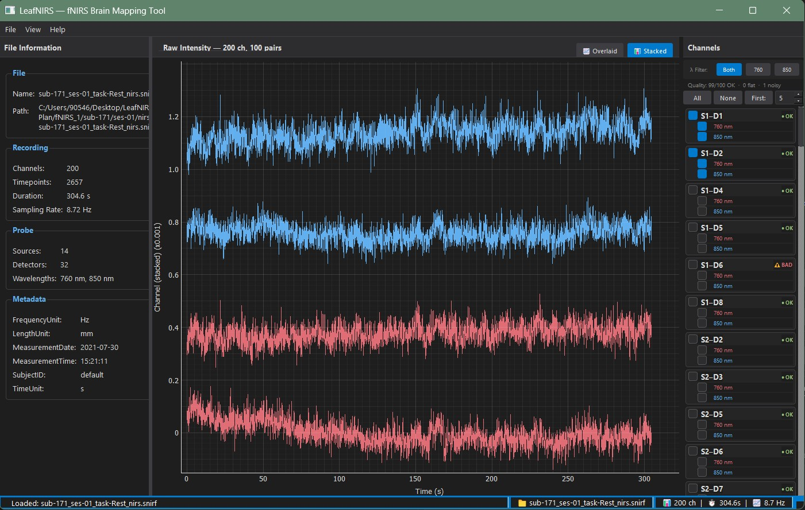

# LeafNIRS

[](https://www.python.org/downloads/)
[](https://opensource.org/licenses/MIT)
[](https://github.com/ozgurzr/LeafNIRS/releases)
[](https://pypi.org/project/PyQt5/)
[](https://fnirs.org/resources/software/snirf/)

A Python-based **fNIRS Brain Mapping Tool** for signal processing, GLM statistical analysis, and 3D cortical visualization — supporting the [SNIRF](https://fnirs.org/resources/software/snirf/) standard.

> [!NOTE]
> This project is under active development as a senior design project at Acibadem Mehmet Ali Aydinlar University, Department of Biomedical Engineering.



---

## Features

### Data Loading & Visualization
- SNIRF / HDF5 file loading with dual loader backends (snirf library & raw h5py)
- Dark-themed interactive GUI with real-time multi-channel plotting
- Source-detector pair grouping with per-wavelength filtering
- Automatic signal quality assessment (CV-based: OK / Flat / Noisy)
- Stacked and overlaid view modes with stimulus onset markers

### Signal Processing Pipeline
- Intensity → optical density conversion (Beer-Lambert law)
- Butterworth bandpass filter (zero-phase via `scipy.filtfilt`)
- Motion correction: TDDR (Fishburn et al., 2019) and cubic spline interpolation
- Auto/Manual processing mode — auto-applies OD → TDDR → bandpass on file load

### Concentration Analysis
- Modified Beer-Lambert Law (MBLL): OD → ΔHbO / ΔHbR (μmol/L)
- Extinction coefficient table (690–1000 nm) from Scott Prahl
- DPF table (Scholkmann & Wolf, 2013) with nearest-wavelength lookup
- HbO/HbR dual time-series viewer with red/blue color coding

### GLM Statistical Analysis
- OLS-based General Linear Model with canonical HRF (SPM double-gamma)
- Design matrix: stimulus convolution + polynomial drift regressors
- Per-channel t-statistics and two-tailed p-values
- 2D probe activation map with significance thresholding

### 3D Brain Visualization
- FreeSurfer `fsaverage5` cortical mesh (20,484 vertices) via nilearn
- KD-tree based probe-to-surface projection onto dorsal cortex
- Interactive chromophore, condition, and p-threshold controls
- Anatomical orientation labels (L/R/A/P)

### Block Averaging
- Epoch extraction with configurable pre/post stimulus windows
- Baseline correction (pre-stimulus subtraction)
- Block-averaged HRF with SEM shading
- Batch processing script for multi-subject analysis

## Quick Start

```bash
git clone https://github.com/ozgurzr/LeafNIRS.git
cd LeafNIRS
python -m venv venv
.\venv\Scripts\Activate.ps1
pip install -r requirements.txt
python run.py
```

Or use the one-click launcher: **`LeafNIRS.bat`**

Then use **File → Open SNIRF…** to load a `.snirf` file.

## Running Tests

The automated GUI test suite validates all 44 steps of the pipeline:

```bash
python tests/test_gui_automated.py
```

Unit tests for individual modules:

```bash
python -m pytest tests/ -v
```

> Tests require `.snirf` data files. Place any SNIRF dataset in a `fNIRS_1/` folder next to the repo.

## Project Structure

```text
LeafNIRS/
├── run.py                              # Entry point
├── LeafNIRS.bat                        # One-click launcher
├── requirements.txt
├── src/
│   ├── data_io/                        # SNIRF loaders
│   │   ├── snirf_loader_base.py        # Abstract interface + data model
│   │   ├── snirf_loader_lib.py         # Method A: snirf library
│   │   └── snirf_loader_h5py.py        # Method B: raw h5py
│   ├── core/                           # Application logic
│   │   ├── data_manager.py             # Loader orchestration + Qt signals
│   │   └── config_manager.py           # User preferences
│   ├── gui/                            # PyQt5 interface
│   │   ├── main_window.py              # Main application window
│   │   ├── file_info_panel.py          # File metadata display
│   │   ├── graph_widget.py             # Multi-channel time-series viewer
│   │   ├── processing_panel.py         # Pipeline control panel
│   │   ├── epoch_viewer.py             # Block-averaged HRF viewer
│   │   ├── probe_map_widget.py         # 2D probe activation map
│   │   └── brain_viewer_widget.py      # 3D cortical surface viewer
│   └── processing/                     # Signal processing
│       ├── od_converter.py             # Intensity → optical density
│       ├── bandpass_filter.py          # Butterworth bandpass
│       ├── motion_correction.py        # TDDR + spline correction
│       ├── mbll_converter.py           # Modified Beer-Lambert Law
│       ├── glm_analysis.py             # GLM with canonical HRF
│       ├── epoch_extraction.py         # Epoch extraction + block avg
│       ├── brain_mesh.py               # 3D cortical mesh loading
│       └── pipeline.py                 # Processing state manager
├── scripts/
│   └── batch_block_average.py          # Multi-subject batch processing
├── tests/
│   ├── test_gui_automated.py           # 44-step GUI integration test
│   ├── test_snirf_loaders.py           # Loader unit tests
│   ├── test_e2e.py                     # End-to-end pipeline test
│   └── test_glm.py                     # GLM unit tests
└── docs/
    └── PROJECT_PLAN.md                 # Development plan
```

## Roadmap

| Phase | Focus | Status |
|-------|-------|--------|
| **1** | Data loading & basic visualization | ✅ Complete |
| **2** | Bandpass filtering & signal processing | ✅ Complete |
| **3** | Modified Beer-Lambert Law (HbO / HbR) | ✅ Complete |
| **4** | 3D brain mapping & GLM analysis | ✅ Complete |
| **5** | Export (CSV, MATLAB, SNIRF) & group analysis | 🔜 Next |

## Dependencies

```
PyQt5 >= 5.15
numpy
scipy
h5py
pyqtgraph
snirf
nilearn >= 0.10
nibabel >= 4.0
```

## License

This project is licensed under the MIT License — see [LICENSE](LICENSE) for details.

See [CONTRIBUTING.md](CONTRIBUTING.md) for guidelines on contributing to this project.
